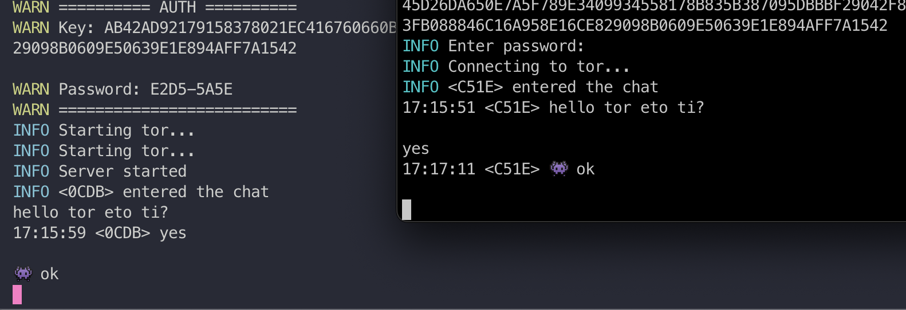

# SHAI HULUD
Secure, command-line interface (CLI) chat application that leverages the Tor network for enhanced privacy.

It's peer-to-peer meaning that there is no central server. User A creates a chat server and user B connects to it.

The access key is an AES-encrypted version of the Tor onion address, shared in a human-readable hex format.

User B enters the access key and password to decrypt the onion address and connect to user A.

Users exchange messages encrypted with each other's RSA public keys.



# Whats up with the name?
Shai-hulud is the name of the giant sandworms in the Dune universe. 

# Dependencies
[Tor The Onion Router](https://www.torproject.org/download/) - free and open-source software for enabling anonymous communication by directing Internet traffic through a free overlay network.

Mac OS
```
brew install tor
```

Linux:
```
sudo apt-get update
sudo apt-get install tor
```


# Current stage: 
- Project is still under development.
- Chat is working over tor connection with RSA encryption and keys exchange.
- Messages are encrypted with RSA public key of the recipient.

- TUI is not implemented yet, but you can chat via terminal.

# Connection flow
- Client A starts the tor server, generates access key, which is onion address encrypted with a password
- Client A shares the access key and password with Client B
- Client B enters the access key and password to decrypt the onion address
- Client B connects to the onion address
- Clients exchange public keys
- Clients encrypt messages with each other's public keys


# Access key and password
The access key is a readable binary key in hex format
that resembles 1234-ABCD-EFGH-5678....
This key represents the AES-encrypted onion address.

The password is used to encrypt/decrypt the access key to obtain the onion address,
which takes a form like 1234-ABCD.

The password consists of random bytes converted to upper-case hex format.

It is also used to sign messages via HMAC to verify message integrity.

# Workflow:
User A (server), after connecting to Tor and generating an onion address, encrypts this address with a randomly generated password.

User A then shares the access key (AES-encrypted onion address) and password with User B.

The password and access key should be shared via different channels for security.

User B enters the access key and then the password to decrypt the onion address.
```


                                                                       
+----------------+                                                        +-------------+
|     User A     |                                                        |    User B   |
|    (Server)    |                                                        |   (Client)  |
+-------+--------+                                                        +--------+----+
        |                                                                          |
        |                                                                          |
        |<------------>Connects to Tor Network                                     |
        |                                                                          |
        |--->Generates random password, encrypts onion address with password       |
        |                                                                          |
        |--->Generates access key (AES-encrypted onion address)                    |
        |                                                                          |
        |-------------------------- Shared Access Key ---------------------------->|
        |                                                                          |
        |-------------------- Shares password via Channel 2 ---------------------->|
        |                                                                          |
        |                                                                          |
        |        Enters access key and password to decrypt onion address <---------|
        |                                                                          |
        |                            Decrypts the key with the password  <---------|
        |                                                                          |
        |                                        Connects to Tor Network <---------|
        |                                                                          |
        |                                             Connects to User A <---------|
        |                                                                          |
        |<------------------------- RSA pub key exchange ------------------------->|
        |                                                                          |
        |<---------- Users verify message integrity via HMAC signature ----------->|
        |                                                                          |
+-------+--------+                                                        +--------+----+
|     User A     |                                                        |    User B   |
|    (Server)    |                                                        |   (Client)  |
+----------------+                                                        +-------------+
```
# ENVS
- TOR=0 - disable tor connection for dev purposes
- DEBUG=1 - enable debug mode
- TUI=1 - enable Text User Interface mode (work in progress)


# TODO
- [ ] restore last session
- [ ] graceful shutdown
- [x] allow reconnect
- [ ] encode access key as BEP39 mnemonic
- [ ] add timestamps to the messages to prevent replay attacks
- [ ] sign every message with hmac to verify integrity and prevent MITM attacks
- [ ] ack on handshake received
- [ ] ack on every message
- [ ] chat gui (tui)
- [ ] send files
- [ ] allow multiple users in a chat room
- [ ] test coverage for all packages
- [x] onion routing
- [x] gen chat key for access, hide onion
- [x] server generate key with password
- [x] client enters key and password to connect
- [x] test coverage for crypto packages
- [x] basic tcp echo server
- [x] basic chat server-client
- [x] custom protocol with header
- [x] chat via custom protocol
- [x] handshake on connection, exchange public keys
- [x] encrypt chat with public key
- [x] basic tor tcp connection
